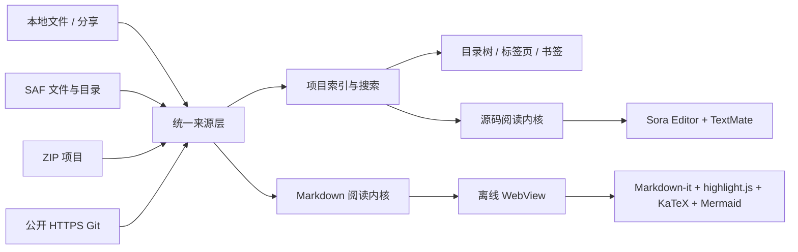

<div align="center">

# 灵阅 · LingYue

### 把项目带在手机里，打开即读。

面向开发者的 Android 原生源码与 Markdown 阅读器，
让目录、搜索、代码高亮和文档渲染在小屏幕上依然清晰顺手。

<p>
  <a href="https://github.com/lonnnnnng/android-code-reader/releases/latest"></a>
  <a href="https://github.com/lonnnnnng/android-code-reader/blob/main/LICENSE"></a>
  <br>
  
  
  
</p>

<p>
  <a href="https://github.com/lonnnnnng/android-code-reader/releases/latest">下载最新 APK</a>
  ·
  <a href="docs/产品路线图.md">查看产品路线图</a>
  ·
  <a href="https://github.com/lonnnnnng/android-code-reader/issues">提交 Issue</a>
</p>

</div>

<br>

> 灵阅的定位不是把完整 IDE 搬到手机上，而是把“打开项目 → 找到文件 → 读懂代码 → 继续上次阅读”这条路径做得可靠、快速、舒服。

## 一眼看懂

<table>
  <tr>
    <td align="center"><br><sub>首页与来源入口</sub></td>
    <td align="center"><br><sub>Darcula 源码阅读与多标签</sub></td>
    <td align="center"><br><sub>Markdown 离线预览</sub></td>
  </tr>
  <tr>
    <td align="center"><br><sub>数学公式与 Mermaid</sub></td>
    <td align="center"><br><sub>主流语言语法高亮</sub></td>
    <td align="center"><br><sub>横屏阅读布局</sub></td>
  </tr>
</table>

## 目录

- [产品亮点](#产品亮点)
- [快速体验](#快速体验)
- [能力一览](#能力一览)
- [支持的文件类型](#支持的文件类型)
- [技术架构](#技术架构)
- [构建与验证](#构建与验证)
- [安全与隐私](#安全与隐私)
- [路线图](#路线图)
- [许可证与第三方声明](#许可证与第三方声明)

## 产品亮点

### 多种来源，一个阅读内核

本地文件、系统分享、SAF 文件/目录、ZIP 项目、公开 HTTPS Git 仓库和内置示例，都会进入统一的项目与文档模型。来源不同，阅读、搜索、标签页和书签的体验保持一致。

### 为“阅读代码”而设计

- 可折叠项目树，完整索引目录与文件，不再截断前 5000 个条目。
- 文件内搜索、项目全局搜索、文件名/路径筛选、命中高亮和精确行列跳转。
- 多文件标签页；每个标签页独立保留草稿、编辑状态、Markdown 模式和阅读位置，未保存草稿可在进程重建后恢复。
- 文件书签、行书签、跳转到行、自动换行和完整路径复制。
- 在可写项目根目录新增文件；创建前可从 77 个常见源码、脚本、配置、基础设施和 Markdown 模板中选择，自动生成对应文件名、扩展名和可直接编辑的最小代码骨架。Local、应用内导入的 ZIP、已克隆 Git 工作区和可写 SAF 目录都按底层写权限决定是否显示入口，创建后立即打开并进入编辑状态。
- 大文件按设备内存预算进入分段只读模式，搜索可以扫描到尚未加载的后半段，并可按原始字节导出完整副本。

### Markdown 不只是纯文本

Markdown 源码与预览一键切换，预览内核完全使用 APK 内置资源，支持：

| 常用语法 | 高级内容 | 阅读辅助 |
| --- | --- | --- |
| 标题、引用、列表、表格、任务列表、脚注 | YAML Front Matter、代码块高亮、KaTeX 数学公式、Mermaid 流程图、本地图片 | 目录跳转、代码块复制、图片放大、相对附件、跨标签预览缓存、源码/预览位置同步、自包含 HTML/PDF 导出、渲染结果分享、渲染文本复制、明暗主题、离线渲染 |

### 可靠地打开各种工程文件

- 自动识别 UTF-8、UTF-8 BOM、UTF-16、GB18030/GBK、Big5 和 Latin-1，并显示当前编码。
- 保存时沿用当前编码和 BOM；本地文件使用同目录临时文件原子替换，SAF 写入失败会尝试回滚原始字节。
- 草稿恢复会校验原正文指纹；文件被其他工具改过时先让用户选择文件版本或草稿版本，不静默覆盖。
- 二进制文件进入独立识别页，不会被误当作文本编辑。
- 权限失效、文件消失、编码异常和读取失败都有可恢复的错误页与重试入口。

### Git 够用、可控、不静默覆盖

支持公开 HTTPS 仓库浅克隆和已克隆仓库的安全快进更新。获取更新会先执行 `fetch`，再展示当前分支、HEAD/目标提交、新提交摘要、文件新增/修改/删除范围及本地修改；只有工作区干净且分支、上游、HEAD 和目标提交都未变化时，才会应用用户确认的精确 `FF_ONLY` 更新。分叉、游离 HEAD、无上游、本地修改或编辑器未保存草稿都会暂停更新，不自动合并或覆盖用户内容。

### 轻量编辑，而不是移动端 IDE

默认只读，确认进入编辑模式后可对本地文件和可写 SAF 文件做小范围修改；支持撤销/重做、当前/全部替换、正则捕获组、自动缩进、括号与引号补全、2/4/8 Tab 宽度、空格/Tab 缩进、常用行操作、剪贴板操作、多行粘贴缩进优化、自动草稿恢复和安全保存。常用命令集中在紧凑的“编辑操作”面板，只读源码仍可选中当前行和复制内容；不可写来源与分段大文件可通过系统文件创建器导出完整原文件副本，过程显示进度并支持取消。灵阅当前不负责编译、运行、调试、完整 LSP 或 IDE 级重构，把资源留给稳定阅读。

## 快速体验

### 直接安装

从 [Releases](https://github.com/lonnnnnng/android-code-reader/releases) 下载正式 APK。当前正式版本：

**[灵阅 v0.1.26](https://github.com/lonnnnnng/android-code-reader/releases/tag/v0.1.26)**

安装包：

- [AndroidCodeReader-v0.1.26.apk](https://github.com/lonnnnnng/android-code-reader/releases/download/v0.1.26/AndroidCodeReader-v0.1.26.apk)
- [SHA256SUMS](https://github.com/lonnnnnng/android-code-reader/releases/download/v0.1.26/SHA256SUMS)

### 三步开始阅读

1. 从文件管理器、微信/邮件/网盘等应用使用“打开方式”或“分享”选择灵阅。
2. 或在首页选择“打开文件 / 打开项目 / 导入 ZIP / 克隆 Git”。
3. 在项目树中打开文件；需要定位时使用搜索、标签页、书签或 Markdown 目录。

### 从源码构建

```bash
git clone https://github.com/lonnnnnng/android-code-reader.git
cd android-code-reader
./gradlew assembleDebug
```

Debug APK 输出在 `app/build/outputs/apk/debug/app-debug.apk`，Debug 包使用独立应用 ID `com.lonnnnnng.codereader.debug`，可以和正式版并存。

## 能力一览

| 能力域 | 已实现内容 |
| --- | --- |
| 文件入口 | `ACTION_VIEW`、`ACTION_EDIT`、`ACTION_SEND`；本地文件、SAF、ZIP、Git、内置示例 |
| 项目导航 | 完整索引、可折叠目录树、最近打开、快速文件切换、当前文件定位 |
| 搜索定位 | 文件内搜索、项目全局搜索、大小写/整词/正则、目录和文件类型范围、命中上下文 |
| 持续阅读 | 多标签页、阅读位置恢复、文件书签、行书签、跳转到行 |
| 源码阅读 | Sora Editor、行号、TextMate 语法高亮、自动换行、编码切换 |
| 轻量编辑 | 新增文件、撤销/重做、查找替换、自动缩进、括号补全、Tab/空格缩进、选中/删除行、复制/剪切/粘贴、缩进/反缩进、多行粘贴优化、跨进程草稿恢复、安全保存，以及不可写来源/大文件完整副本导出 |
| Markdown | 源码/预览、语义块位置同步、Front Matter 折叠、代码高亮、KaTeX、Mermaid、本地图片与附件、图片放大、表格、任务列表、脚注、固定可折叠目录、代码复制、内联图片/字体的单文件 HTML、PDF 导出、渲染结果分享、渲染文本复制 |
| 项目导入 | ZIP 安全解压、路径穿越拦截、公开 HTTPS Git 浅克隆、更新预览与精确快进 |
| 显示与编辑设置 | 11–24 sp 字号、阅读背景、整体配色、明暗模式、Darcula/高对比亮色代码主题，以及输入与缩进偏好 |
| 在线更新 | GitHub Latest Release 检查、下载进度、SHA-256/包名/版本/签名校验、系统安装器接管安装 |

### 目前明确的边界

- Git 当前支持公开 HTTPS、浅克隆、更新前提交/文件范围预览、工作区与未保存草稿保护，以及精确安全快进；暂不支持 SSH、Token、私有仓库、分支/Tag/Commit 浏览、完整行级 Diff 和冲突查看/处理。
- 超过设备可承受范围的大文件自动进入只读分段模式，不能直接编辑保存，但可以重新读取原始字节并导出完整副本。
- 新增文件只针对项目根目录；只读 SAF 或其他不可写来源会隐藏该入口。应用内导入 ZIP 和已克隆 Git 工作区如果底层目录可写则可以创建；Git 更新仍会把新文件作为未跟踪修改纳入安全更新保护。当前不提供新建目录和指定子目录创建。
- 新增文件入口位于首页一级操作区，以独立主操作卡片呈现；如果当前没有可写项目，会先引导选择项目目录，再打开文件名输入框。
- Markdown 预览默认禁用原始 HTML 和远程图片联网加载；本地图片与附件只解析当前项目索引内的相对路径，图片、KaTeX 和 Mermaid 单项失败时保留原始内容并提供源码回退。
- 灵阅不是编译器、调试器或完整移动 IDE。

## 支持的文件类型

当前 `FileType` 映射约 **78 种文件类型**，其中 **73 个类型带独立 TextMate grammar**，并已在 Pixel_9 模拟器完成 `78/78` 语法覆盖验证。

<details>
<summary>展开完整分类</summary>

**语言与运行时**

Java、Kotlin、AIDL、Clojure、Scala/SBT、Python、Go/Go Module、Rust、Dart、Swift、Zig、Julia、Fortran、R、PHP、Blade、Perl、Lua、Lisp、Ruby、C、C++、Objective-C、Objective-C++、Assembly、C#、F#、Visual Basic、Smali。

**Web 与模板**

JavaScript、JSX、TypeScript、TSX、Vue、Svelte、Astro、HTML、CSS、SCSS、Sass、Less、ERB、Twig、Razor、XML/XAML/SVG。

**数据、配置与接口**

JSON/JSONC、YAML/YML、TOML、Properties、INI/CFG、Dotenv/ENV、SQL、GraphQL、Protocol Buffers、Prisma、LaTeX。

**构建、基础设施与脚本**

Groovy/Gradle、CMake、HCL、Terraform、Nix、Nginx、Dockerfile、Makefile、Shell、Batch、PowerShell、ProGuard/R8、.NET Solution/Project。

**文档与兜底类型**

Markdown、MDX、TXT、LOG、CSV，以及无法识别时的 Plain Text 阅读。

</details>

## 技术架构



| 层次 | 技术与职责 |
| --- | --- |
| 产品界面 | Kotlin、Jetpack Compose、Material 3；负责导航、设置、弹层、项目树和阅读状态 |
| 源码编辑器 | [Sora Editor](https://github.com/Rosemoe/sora-editor) `0.24.6`、TextMate grammar、TM4E Joni 正则引擎；负责行号、语法高亮、编辑与跳转。移动端关闭 native Oniguruma，避免复杂 YAML grammar 触发 `libonig.so` 崩溃 |
| Markdown 预览 | WebView + APK 内置 `markdown-it`、`highlight.js`、`KaTeX`、`Mermaid`；只承担 Markdown 高级渲染 |
| 数据源 | Android Storage Access Framework、`DocumentFile`、应用私有目录、ZIP 流式解压、[Eclipse JGit](https://www.eclipse.org/jgit/) |
| 领域能力 | `ProjectIndex`、`TextSearch`、`MarkdownOutlineParser`、编码检测、动态内存预算和大文件分页 |
| 状态与异步 | `ViewModel`、Kotlin Coroutines、`SharedPreferences`；持久化最近项目、阅读位置、书签和显示偏好 |
| 构建环境 | Android Gradle Plugin `9.2.1`、Kotlin `2.3.21`、Java `17`、最低 API `24`、目标 API `36` |

### 为什么源码不用 WebView

普通源码阅读使用原生 Sora Editor，获得更稳定的滚动、光标、行号、选择和编辑体验；WebView 只用于 Markdown，因为数学公式、Mermaid 和复杂排版更适合在离线 HTML 渲染层完成。这是灵阅在“阅读性能”和“文档表现力”之间的刻意分工。

## 构建与验证

日常构建：

```bash
./gradlew assembleDebug
```

发布前完整检查：

```bash
./gradlew testDebugUnitTest lintDebug assembleDebug assembleDebugAndroidTest assembleRelease --console=plain
```

当前质量基线：

- `Pixel_9` Android 模拟器当前全量 instrumentation：`91/91` 通过；覆盖新增文件类型选择、扩展名补齐、模板正文写入和新增文件弹窗交互反馈。
- 语法覆盖：`78/78` 通过。
- 覆盖 ZIP 路径安全、Git 克隆/更新预览/修改保护/精确快进、项目完整索引、大文件分段搜索、Markdown DOM 与本地资源渲染、编辑器输入偏好、常用行与剪贴板操作、跨进程草稿恢复、安全保存、完整原始字节副本导出、导出取消与失败清理、设置持久化和在线更新校验。
- 当前项目回归严格使用 Pixel_9 模拟器；Redmi Note 8 Pro 真机不属于当前验证范围。

完整命令、测试项和边界记录见 [模拟器验证报告](docs/模拟器验证报告.md)。

## 安全与隐私

- 已导入的源码和 Markdown 默认在本地处理；Markdown 的高亮、公式和流程图资源随 APK 打包，本地图片与附件通过当前项目索引离线读取。
- 未保存草稿位于 Android 明确排除备份的应用私有 `noBackupFilesDir`，不进入云备份或换机迁移。
- 网络仅用于用户主动触发的公开 HTTPS Git 克隆/更新，以及“关于与更新”中的固定 GitHub Release 检查与下载。
- ZIP 导入会拦截路径穿越并清理失败的半成品目录。
- 在线更新只接受固定 GitHub 仓库的正式 Release，并在交给系统安装器前校验文件摘要、大小、应用 ID、版本号和签名证书。
- 应用不会静默安装 APK；安装流程始终由 Android 系统安装器接管。

## 路线图

当前 M1（可靠打开、项目索引、搜索、持续阅读）、M2（Markdown 阅读）和 M3（安全轻量编辑）主要切片已完成，M4 Git 生命周期已进入分步实施：

| 阶段 | 方向 | 状态 |
| --- | --- | --- |
| M1 | 编码、大文件、完整索引、搜索、阅读位置与书签 | ✅ 已完成 |
| M2 | Front Matter、本地资源、失败回退、预览缓存、源码/预览同步、固定目录、HTML/PDF 导出与渲染结果分享 | ✅ 已随 v0.1.18 发布 |
| M3 | 撤销/重做、查找替换、输入辅助、常用行操作、跨进程草稿恢复、安全保存和不可写来源/大文件副本导出 | ✅ 已随 v0.1.19 发布 |
| M4 | Git 认证、分支/Tag、Diff、冲突查看、离线刷新 | 🚧 更新预览、修改保护与冲突文件只读查看已随 v0.1.20 发布 |
| M5 | 符号大纲、TODO/日志导航、结构化视图、多项目工作区 | 🧭 规划中 |

详见 [灵阅产品路线图](docs/产品路线图.md)。欢迎通过 Issue 讨论真实阅读场景，但每个新功能都需要说明它对打开速度、内存占用、离线可用性和失败恢复的影响。

## 许可证与第三方声明

本项目以 [Apache License 2.0](LICENSE) 发布。编辑器、Markdown 渲染器、语法资源和 Git 相关依赖的许可证与来源见 [THIRD_PARTY_NOTICES.md](THIRD_PARTY_NOTICES.md)。

<div align="center">

<sub>灵阅 · 为移动端源码阅读而生</sub>

</div>
