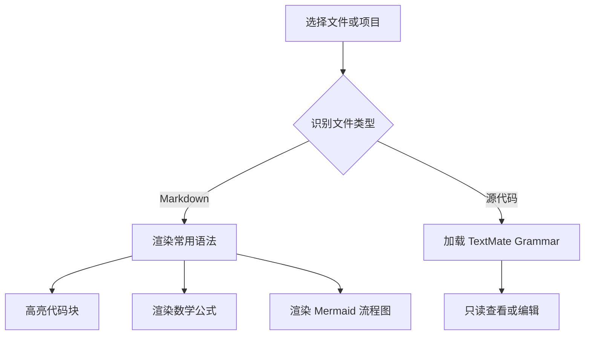

# Markdown 综合能力验证

> 这份文档用于验证源码阅读器的常用 Markdown、代码高亮、数学公式和 Mermaid 流程图。

## 文本格式

普通文本支持 **粗体**、*斜体*、***粗斜体***、~~删除线~~、`inline code`，以及 [GitHub 链接](https://github.com/)。

需要显示 Markdown 控制字符时可以转义：\*不是斜体\*、\# 不是标题。

第一行末尾保留两个空格，  
这里验证强制换行。

### 引用

> 一级引用适合展示说明或日志摘要。
>
> > 二级引用可以表达嵌套上下文。

---

## 列表和任务

- Java、Kotlin 和 Go 源码
- JSON、YAML 和 TOML 配置
  - 支持嵌套无序列表
  - 保持层级缩进

1. 打开项目目录
2. 选择源码文件
3. 阅读或进入编辑模式

- [x] CommonMark 基础语法
- [x] 表格和任务列表
- [x] 代码块语法高亮
- [x] 数学公式
- [x] Mermaid 流程图
- [ ] 后续支持更多图表交互

## 表格

| 能力 | 示例 | 状态 |
| :--- | :---: | ---: |
| 代码高亮 | Java / JSON / Bash | 已支持 |
| 数学公式 | KaTeX | 已支持 |
| 流程图 | Mermaid | 已支持 |

## 代码高亮

Java 代码块需要明显区分注解、关键字、类型、函数、字符串、数字和注释：

```java
@RestController
public final class UserController {
    private static final int DEFAULT_LIMIT = 20;

    // 返回当前用户列表，limit 用于控制单次读取数量。
    @GetMapping("/api/users")
    public List<String> listUsers(@RequestParam(defaultValue = "20") int limit) {
        return List.of("Alice", "Bob").stream().limit(limit).toList();
    }
}
```

JSON 配置块：

```json
{
  "service": "code-reader",
  "enabled": true,
  "retryCount": 3,
  "languages": ["java", "python", "go", "rust"]
}
```

Bash 命令块：

```bash
#!/usr/bin/env bash
set -euo pipefail
echo "build AndroidCodeReader"
./gradlew assembleDebug
```

没有声明语言的代码块仍应保持等宽字体和独立背景：

```
GET /health
200 OK
```

## 数学公式

行内公式示例：质能方程 $E = mc^2$，勾股定理 $a^2 + b^2 = c^2$。

块级积分公式：

$$
\int_{0}^{\infty} e^{-x^2}\,dx = \frac{\sqrt{\pi}}{2}
$$

矩阵公式：

$$
\begin{bmatrix}
1 & 2 \\
3 & 4
\end{bmatrix}
\begin{bmatrix}
x \\
y
\end{bmatrix}
=
\begin{bmatrix}
x + 2y \\
3x + 4y
\end{bmatrix}
$$

## Mermaid 流程图



## 脚注

Markdown 预览使用本地打包资源，不需要联网加载渲染脚本。[^offline]

[^offline]: 离线资源包括 Markdown-it、highlight.js、KaTeX 和 Mermaid。
