# 源码阅读器模拟器验证报告

> 验证时间：2026-07-19 17:27 CST  
> 验证设备：`Pixel_9` AVD，Android 15/API 35，`emulator-5554`  
> 应用 ID：`com.lonnnnnng.codereader`  
> 验证边界：当前 App 只允许使用模拟器验证；本报告不采用任何 Redmi 真机结果。

## 结论

当前 Debug 版本已经完成以下主链路：

- 外部系统文件选择器打开 `content://` 文件。
- SAF 目录/项目授权、目录列表和文件打开。
- 应用私有项目目录浏览。
- ZIP 导入、单根目录折叠、条目数量/总大小限制和路径穿越拦截。
- 公共 HTTPS Git 仓库浅克隆。
- 默认只读的 Sora Editor 阅读界面。
- 本地文件和 SAF 文件编辑、保存。
- 可折叠的项目树，嵌套目录和文件使用完整路径索引。
- 文件内搜索、项目全局搜索、按路径过滤的快速文件切换。
- 最多 6 个可恢复的最近项目，支持 SAF URI 和应用私有目录。
- 多文件标签页，每个标签页独立保留草稿、编辑状态和 Markdown 预览状态。
- 阅读页使用文件名/类型/状态两级标题、编辑器式活动标签和紧凑上下文工具栏；新增标签会自动滚动到可见区域。
- 文件内搜索原位替换上下文工具栏，关闭后恢复文件切换、Markdown 模式和编辑操作，正文高度不会重复跳变。
- TextMate 语法高亮，按文件类型加载独立 grammar。
- 高对比亮色主题和 Darcula 暗色主题，支持首页、目录页、阅读页切换。
- 主题切换会立即刷新当前编辑器和 Markdown 预览，选择写入 `SharedPreferences`。
- 首页、目录页和阅读页只应用一次状态栏安全区，标题不再出现重复顶部留白。
- Markdown 源码/预览切换，覆盖常用语法、表格、任务列表和脚注。
- Markdown 代码块使用 highlight.js 高亮，数学公式使用 KaTeX，流程图使用 Mermaid；全部离线渲染。
- Markdown 目录跳转和代码块一键复制。
- 跳转到行、11-24 sp 字号设置和源码自动换行。
- 超过 1 MB 的文件自动进入只读分段模式，每次追加约 256K 字符。
- 竖屏和横屏布局。

最终 `lintDebug`、14 项 JVM 单元测试、Debug APK、AndroidTest APK 均构建成功。Pixel_9 模拟器上的 9 项 instrumentation 测试全部通过，78/78 语法覆盖通过，crash buffer 为空。

## 文件类型覆盖

模拟器测试会同时验证：文件名识别正确、TextMate grammar 已加载、示例内容产生非根级语义 token。

| 类别 | 测试文件 | 结果 |
| --- | --- | --- |
| Java | `Main.java` | 通过 |
| Kotlin | `Main.kt` | 通过 |
| Python | `service.py` | 通过 |
| Go | `main.go` | 通过 |
| Rust | `lib.rs` | 通过 |
| PHP | `index.php` | 通过 |
| C | `main.c` | 通过 |
| C++ | `main.cpp` | 通过 |
| C# | `Program.cs` | 通过 |
| .NET Project | `App.csproj` | 通过，按 XML 高亮 |
| .NET Solution | `Sample.sln` | 通过，按 INI 高亮 |
| JavaScript | `app.js` | 通过 |
| Node.js ESM | `server.mjs` | 通过 |
| React JSX | `Component.jsx` | 通过，使用专用 `source.js.jsx` grammar |
| TypeScript | `app.ts` | 通过 |
| React TSX | `Component.tsx` | 通过，使用专用 `source.tsx` grammar |
| HTML | `index.html` | 通过 |
| CSS | `styles.css` | 通过 |
| Vue | `App.vue` | 通过 |
| XML | `config.xml` | 通过 |
| SQL | `schema.sql` | 通过 |
| TOML | `app.toml` | 通过 |
| properties | `app.properties` | 通过 |
| YAML | `settings.yaml` | 通过 |
| YML | `config.yml` | 通过 |
| YMAL 兼容拼写 | `legacy.ymal` | 通过 |
| config | `reader.cfg` | 通过 |
| JSON | `data.json` | 通过 |
| Node package | `package.json` | 通过 |
| env | `environment.env` 和运行时 `.env` | 通过 |
| Markdown | `README.md` | 通过 |
| JVM/Android 扩展 | `service.aidl`、`core.clj`、`build.sbt` | 通过 |
| Go 工程文件 | `go.mod` | 通过，使用专用 Go Module grammar |
| Dart/Swift/Zig | `main.dart`、`Package.swift`、`build.zig` | 通过 |
| 科学计算语言 | `analysis.jl`、`solver.f90`、`analysis.r` | 通过 |
| 脚本语言 | `script.pl`、`plugin.lua`、`init.lisp` | 通过 |
| Apple/底层源码 | `ViewController.m`、`Bridge.mm`、`startup.asm` | 通过 |
| Web 框架 | `Component.svelte`、`Page.astro`、`guide.mdx` | 通过 |
| 样式预处理 | `theme.scss`、`theme.sass`、`theme.less` | 通过，使用独立 grammar |
| 服务端模板 | `view.blade.php`、`partial.erb`、`page.twig`、`View.razor` | 通过 |
| 接口和数据模型 | `message.proto`、`schema.graphql`、`schema.prisma` | 通过 |
| Shell/逆向 | `deploy.ps1`、`build.cmd`、`MainActivity.smali` | 通过 |
| 构建和基础设施 | `CMakeLists.txt`、`variables.hcl`、`main.tf`、`flake.nix`、`nginx.conf` | 通过 |
| 工程规则 | `project.ignore`、`proguard-rules.pro` | 通过，使用项目自有 grammar |
| LaTeX | `paper.tex` | 通过 |
| 其余基础 grammar | `Program.fs`、`Module.vb`、`build.sh`、`app.rb`、`build.gradle`、`Dockerfile`、`Makefile` | 通过 |

结果：`78/78`，覆盖全部 73 个带 grammar 的 `FileType`；`PLAIN_TEXT` 不参与语义 token 验证。

## 自动测试

模拟器 instrumentation 测试：

1. `GitCloneInstrumentedTest`
   - 从 `https://github.com/octocat/Hello-World.git` 完成真实浅克隆。
2. `MarkdownPreviewInstrumentedTest`
   - 直接检查 WebView DOM，确认高亮 token、KaTeX 行内/块级公式、Mermaid SVG、表格、任务列表和脚注均已生成。
3. `LargeFileInstrumentedTest`
   - 超过 1 MB 的文件进入只读分段模式，并能继续加载下一段。
   - UTF-16 LE BOM 大文件也能按正确编码进入分段模式。
4. `ProjectImporterInstrumentedTest.zipProjectCanBeImportedAndRead`
   - 导入 ZIP 后读取 Java 和 Markdown 文件。
5. `ProjectImporterInstrumentedTest.zipPathTraversalIsRejected`
   - `../escape.txt` 被拦截，失败目录被清理。
6. `SampleProjectUiTest.openSampleProjectAndReadCSharpFileInReadOnlyMode`
   - 打开内置项目，滚动到 `Program.cs`，进入 C# 只读阅读页。
7. `SampleProjectUiTest.markdownSearchResultOpensSourceAndScrollsToMatchedLine`
   - 全局搜索 `Mermaid`，打开 `README.md:120`，确认切到 Markdown 源码且第 120 行进入 Sora 可见区域。
8. `SyntaxCoverageInstrumentedTest`
   - 所有 78 个声明样例的 grammar 和语义 token 全部通过。
9. `ThemeSwitchInstrumentedTest`
   - 切换亮暗主题、Activity 重建后主题选择保持，并恢复默认亮色。

最终输出：

```text
Starting 9 tests on Pixel_9(AVD) - 15
Finished 9 tests on Pixel_9(AVD) - 15
BUILD SUCCESSFUL
```

## 手工模拟器验证

### 外部文件

- 将 `ExternalMain.java` 放入模拟器 Download。
- 通过 App 的“打开文件”进入系统 DocumentsUI。
- DocumentsUI 授予 `content://` 读取权限后成功打开。
- App 根据显示文件名识别为 Java，而不是依赖 MIME。
- 默认状态为只读，Java 高亮正常。

### SAF 目录

- Android 36 DocumentsUI 按系统规则禁止授权整个 Download 根目录。
- 创建并选择 `Download/CodeSamples` 后授权成功。
- App 列出 `ExternalMain.java`，再次打开并高亮。
- 切换编辑模式，写入 `SAF_EDIT` 并保存；`/sdcard/Download/CodeSamples/ExternalMain.java` 的真实内容已更新。
- 新建并授权 `Documents/CodeReaderSaf`，项目树可正常展开 `demo/backend/Nested.java`，没有重复回到 SAF 根目录或触发 5000 条索引上限。

### 编辑保存

- 内置 `App.vue` 默认只读。
- 点击编辑图标后状态变为“未保存”。
- 输入内容并点击保存后，应用私有文件真实内容发生变化。
- 关闭带 `*` 的未保存标签时会显示“放弃未保存修改？”确认框，可选择继续编辑或放弃并关闭。

### Markdown 高级渲染

- 内置 `README.md` 已扩充为综合样本，覆盖标题、强调、删除线、链接、引用、嵌套列表、任务列表、表格、分隔线、脚注和多语言代码块。
- Java、JSON、Bash 代码块产生不同颜色的关键字、函数、字符串、数字、注解和注释 token。
- 行内公式、积分公式和多行矩阵公式均由 KaTeX 完整渲染。
- Mermaid `flowchart TD` 已生成 SVG，并自动缩放到手机宽度。
- Markdown-it、highlight.js、KaTeX 和 Mermaid 均从 APK assets 读取，渲染时不访问网络。

### 项目阅读和搜索

- 内置项目可依次展开 `demo/backend`，并打开 `UserService.java`。
- 文件内搜索 `findUser` 后，上一个/下一个操作进入可用状态且编辑器高亮命中内容。
- 快速切换列表显示 `demo/backend/UserService.java` 完整路径；切换到 `demo/README.md` 后，文件内搜索栏自动收起。
- 同时打开 `UserService.java` 和 `README.md` 后出现两个标签页，可直接切换和关闭。
- 从 `UserService.java` 执行“跳转到行 6”，光标准确定位到第 6 行。
- 项目全局搜索 `Mermaid` 并打开 `README.md:120`，Markdown 会自动切到源码，第 120 行进入可见区域。

### 阅读页布局

- 主标题优先显示文件名，副标题依次显示文件类型、只读/编辑/未保存状态和项目路径，长路径只截断末尾信息。
- 多标签使用活动底线和弱化的非活动状态；第三个及后续标签打开时，活动标签自动进入可见区域。
- 文件切换、Markdown 源码/预览、编辑和保存操作统一使用 48dp 触控区域，亮色与 Darcula 均有清晰的选中状态。
- 搜索栏包含关闭、上一个和下一个操作，输入框获得焦点后仍保持与普通工具栏相同高度。
- 竖屏、横屏和短 Markdown 文档均已检查；暗色短文档正文结束后不会再露出白色 WebView 背景。

### 运行稳定性

```text
crash buffer: empty
lastanr: <no ANR has occurred since boot>
```

### 主题切换

- 首页、项目目录和文件阅读页均可使用右上角太阳/月亮按钮切换主题。
- 打开 `App.vue` 后直接切换，当前文件无需重新打开即完成从高对比亮色到 Darcula 的重着色。
- 强制停止后重新启动，之前选择的 Darcula 主题仍然生效。
- 暗色 Markdown 预览的背景、正文、表格、任务列表和代码块均已同步适配。

## 截图

### 新版阅读页（Darcula、多标签）

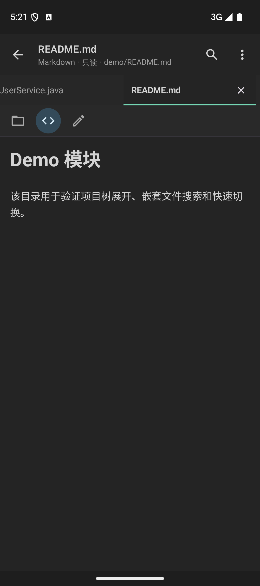

### 新版阅读页（横屏）

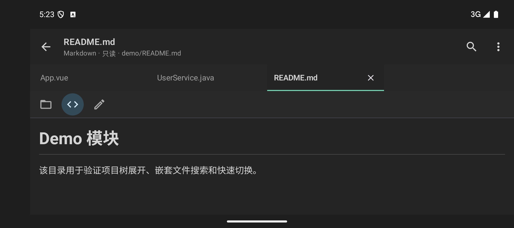

### 首页

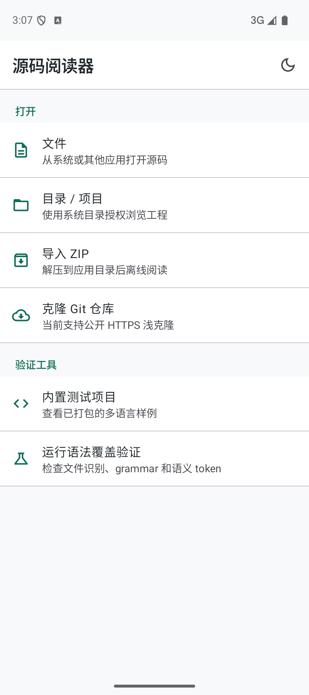

### Vue 高亮

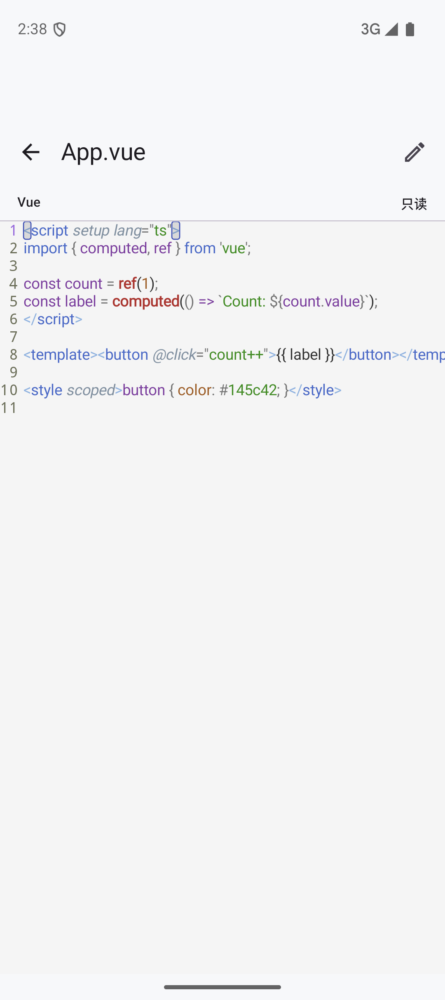

### Markdown 预览

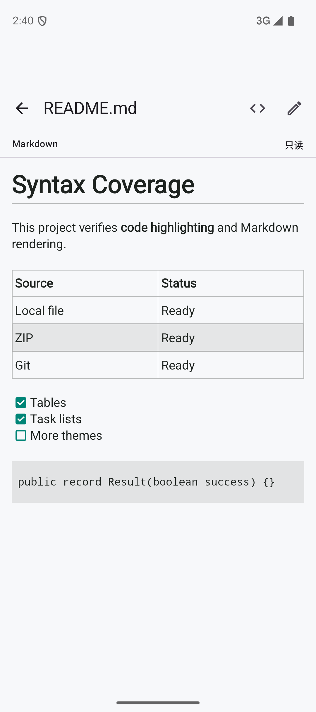

### Markdown 常用语法

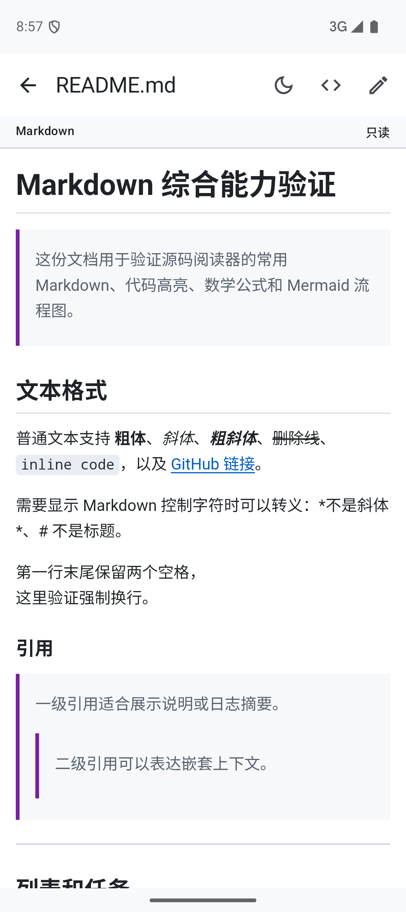

### Markdown 代码高亮

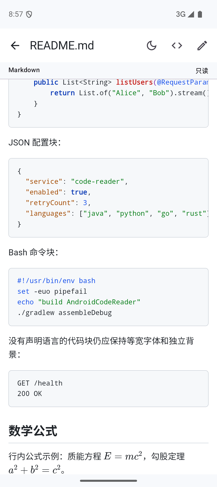

### Markdown 数学公式和 Mermaid

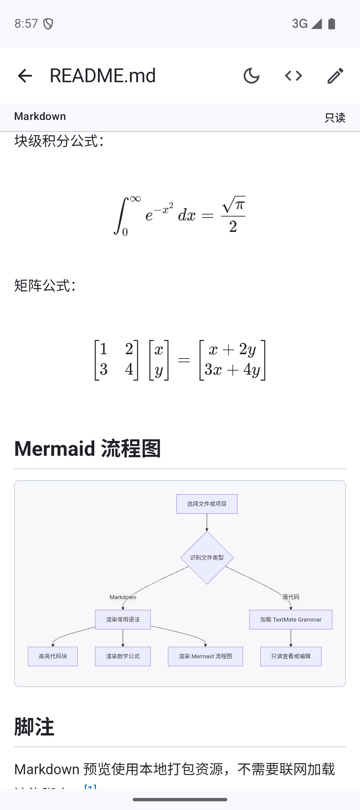

### Darcula Markdown 代码高亮

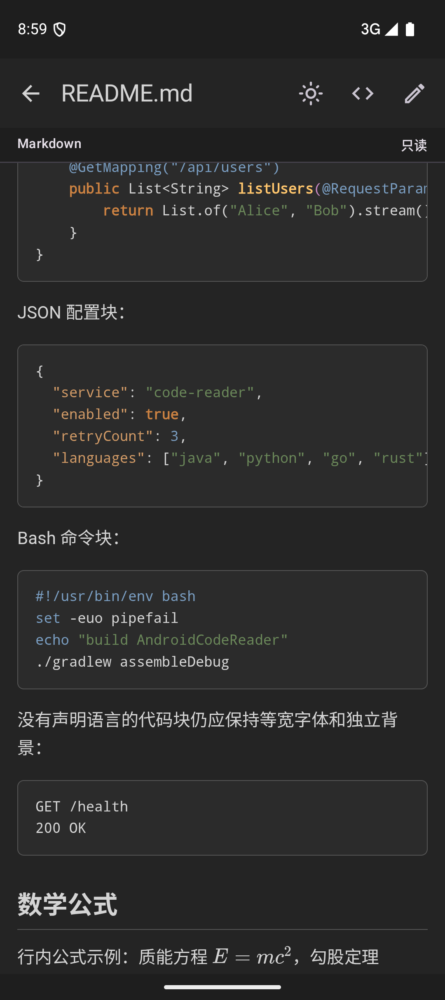

### 外部 Java 文件

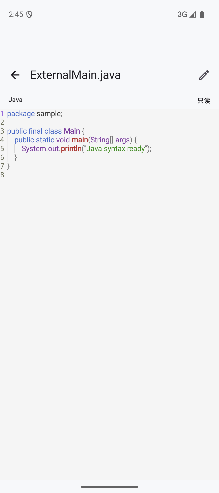

### SAF 目录

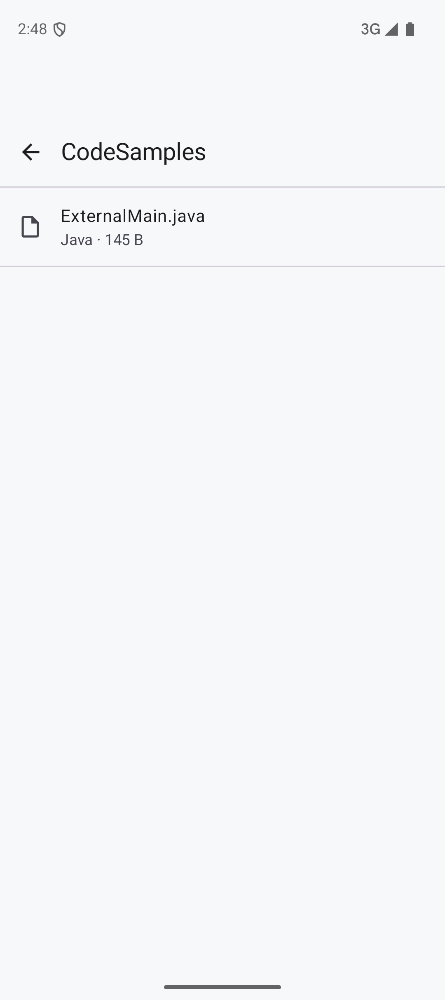

### 横屏

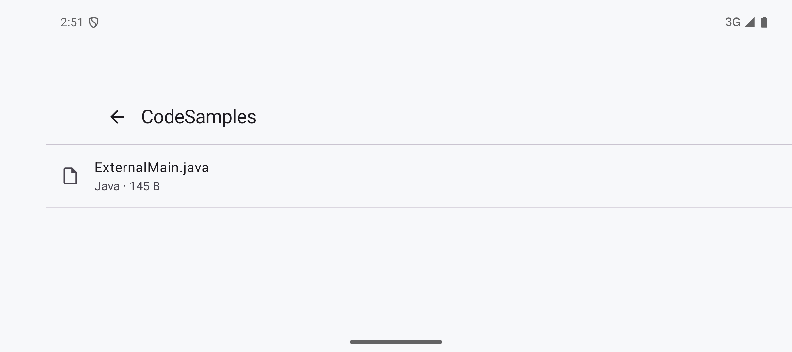

### 高对比亮色 C#

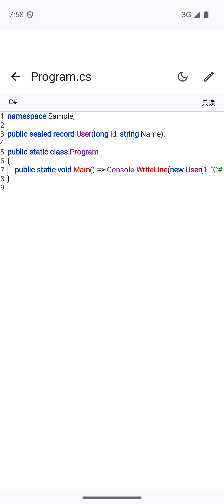

### 高对比亮色 Vue

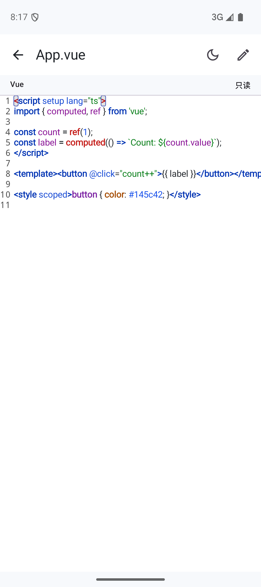

### 高对比亮色 YAML

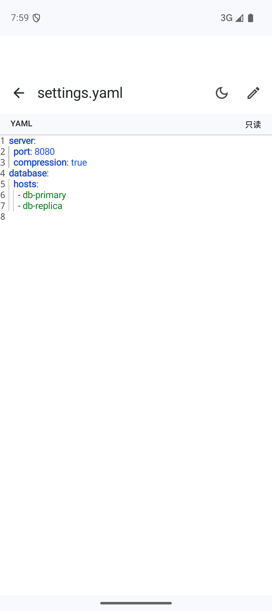

### Darcula Vue

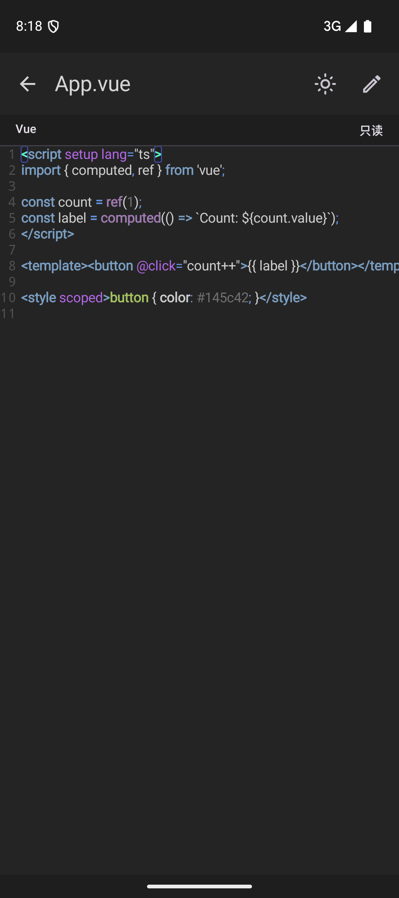

### Darcula Markdown 预览

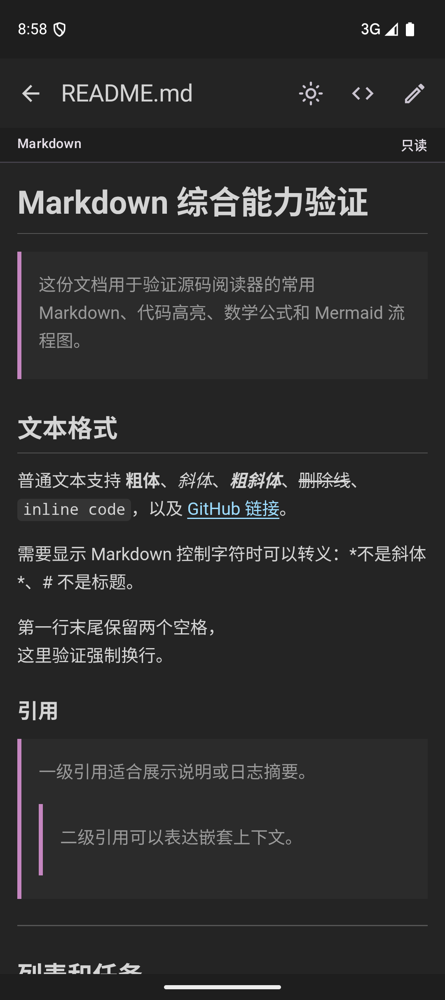

## 构建产物

```text
文件：app/build/outputs/apk/debug/app-debug.apk
大小：30,205,122 bytes（约 28.8 MiB）
SHA-256：98596c6d87033cea71d02bf5a64ae4696020682c750e7f873f13b65eb59a82ea
```

## 已修复问题

1. Gradle wrapper 脚本参数转义不兼容 macOS。
   - 改用 Sora Editor 仓库中由新版 Gradle 生成的 wrapper 脚本。
2. Material 3 主页按钮继承默认紫色 container。
   - 显式配置绿色、灰色和中性色 container。
3. Android assets 中的隐藏 `.env` 无法稳定枚举/打开。
   - 验证资产改为 `environment.env`，复制示例项目时显式生成真正的 `.env`。
4. UI 测试直接查找 LazyColumn 屏幕外的 `Program.cs`。
   - 给列表增加测试标记，滚动到目标后再点击。
5. Android 36 在应用校验前先以 `ZipException` 拦截恶意路径。
   - ZIP 导入边界统一包装错误并清理半成品目录。
6. 默认模拟器安装脚本误判 AVD 不在 adb 且非监督启动退出。
   - 使用 `--supervised` 保持可见 AVD，所有后续安装和 QA 命令显式指定 `-s emulator-5554`。
7. 高亮主题文件名与 TextMate 注册名不一致导致初始化失败。
   - 统一高对比亮色主题的 asset 文件名、主题模型名和持久化映射，并增加切换测试。
8. Material 3 TopAppBar 重复应用状态栏 inset，导致每个页面标题上方留白过大。
   - 首页、目录页和阅读页统一使用空的 TopAppBar windowInsets，保留 Activity 已提供的系统栏安全区。
9. Markdown 测试内容过少，代码块没有语法高亮，也无法验证公式和流程图。
   - 改用离线 WebView 预览内核，加入 Markdown-it、highlight.js、KaTeX、Mermaid 和 DOM 级设备测试。
10. 工程阅读只能逐层进入目录，缺少跨文件导航。
   - 建立统一项目索引，提供可折叠树、项目全局搜索、最近项目和快速文件切换。
11. 多文件往返时会丢失当前草稿和阅读状态。
   - 引入独立标签页状态，同时保留草稿、编辑模式和 Markdown 预览模式。
12. 超大文件依赖整体读入，容易在手机端形成明显卡顿。
   - 超过 1 MB 后改为只读分段加载，每次追加约 256K 字符，并增加设备测试。
13. SAF 嵌套目录重建 `DocumentFile` 时会回到树根。
   - 索引递归改为直接使用 `listFiles()` 返回的子节点，并在真实 DocumentsUI 授权目录上展开三层路径验证。
14. 未保存标签可直接关闭，草稿会无提示丢失。
   - 关闭 dirty 标签时先显示确认框，只有明确选择“放弃并关闭”才删除标签状态。
15. Markdown 全局搜索命中会留在预览页，首次打开时还可能在 Sora 建立行索引前跳转。
   - 命中后自动切回 Markdown 源码，大文件按需追加到目标行，并在编辑器布局稳定后定位。
16. 大文件分段读取固定使用 UTF-8，且大小未知的 SAF 文件无法进入分段模式。
   - 每次分段均识别 UTF-8/UTF-16 BOM；SAF 不提供大小时先读取阈值前缀，超过 1 MB 后直接进入分段模式。
17. Markdown 目录与 WebView 对 Setext、引用和列表内标题的编号可能不一致。
   - 目录解析补齐 Setext、引用和列表容器，忽略缩进代码，并按完整长度匹配围栏关闭标记。

## 当前限制

- 大文件分段加载当前按字符位置从文件头重新 skip；极大文件连续加载后半部时，后续可换成可定位通道或持久流。
- 项目索引最多 5000 个条目；全局搜索跳过超过 2 MB 的单文件，每个文件取前 8 个命中，总结果最多 200 条。搜索是线性扫描，大项目首次搜索仍可能需要等待。
- Git 当前仅支持公开 HTTPS 浅克隆，尚未实现凭据、分支切换和 pull。
- Markdown 为保证安全默认禁用原始 HTML，远程图片也不会在预览 WebView 内联网加载。
- Markdown 预览的首次搜索和目录跳转当前使用页面加载后的短延时调度；极慢设备或超长文档上如果首次未定位，需要再触发一次。
- 当前提供两套代码配色；还没有自定义主题编辑器和跟随系统自动切换选项。
- 最近项目只记录可恢复的 SAF URI 或应用私有目录；内置测试项目和外部单文件不进入列表。
